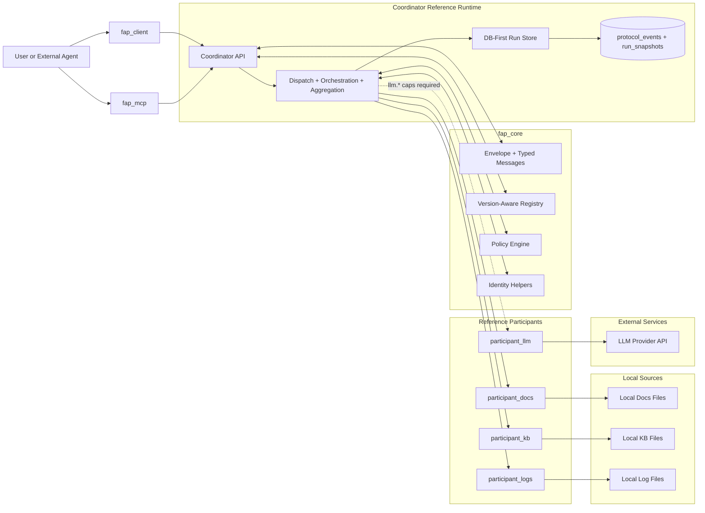

# FAP

Federated Agent Protocol (FAP) is a governed protocol for coordinating work across private domains without centralizing raw private data. Participants execute locally over their own sources, export only policy-governed results as canonical protocol messages, and contribute evidence-linked aggregation inputs to a coordinator.

## Release Status

FAP is currently prepared for its first public alpha release:

- GitHub release target: `v0.1.0-alpha`
- Python distribution version: `0.1.0a0` (PEP 440 pre-release form)
- status: protocol alpha
- reference runtime: included
- developer preview: yes
- production stable: no

This repository is intentionally positioned as:

- a protocol alpha
- a reference runtime
- a developer preview
- not yet a production-ready federated platform

## What FAP Is

FAP defines the message layer and reference runtime for:

- coordinator-managed federated task creation
- participant evaluation and governed execution
- participant discovery through canonical profile/status metadata
- participant-originated aggregation input
- coordinator aggregation over governed contributions
- durable run/event inspection
- explainable evidence pointers back to the local sources that informed a result

In the current alpha, the working runtime includes:

- a shared protocol core with typed messages, codec, version-aware dispatch, policy, and identity helpers
- a DB-first coordinator with durable `protocol_events` and `run_snapshots`
- three local participants:
  - `participant_docs`
  - `participant_kb`
  - `participant_logs`
- one optional outbound participant:
  - `participant_llm`
- participant-originated `fap.aggregate.submit`
- canonical `fap.participant.profile` and `fap.participant.status`
- `summary_merge` aggregation
- source-level evidence refs carried through execution and aggregation payloads
- a thin `/ask` wrapper
- a Python client
- an MCP bridge

## What Ships In `v0.1.0-alpha`

### Libraries

| Import Package | Purpose |
| --- | --- |
| `fap_core` | Shared protocol library: messages, envelope, codec, registry, enums, policy, identity helpers |
| `fap_client` | Thin Python integration layer for `/ask`, run inspection, and event inspection |
| `fap_mcp` | MCP wrapper over `fap_client` for tool-based agent usage |

For this alpha, the monorepo currently installs as a single Python distribution named `fap`
and exposes these import packages from that shared distribution.

### Reference Runtime Apps

| App | Purpose |
| --- | --- |
| `coordinator_api` | DB-first coordinator runtime with dispatch, orchestration, aggregation, `/ask`, and durable state |
| `participant_docs` | Reference participant for local document search and governed export |
| `participant_kb` | Reference participant for local knowledge-base search and governed export |
| `participant_logs` | Reference participant for local log search and governed export |
| `participant_llm` | Optional outbound LLM-backed participant for external queries with governed response export (requires explicit opt-in) |

## High-Level Architecture



## Quickstart

### 1. Install

From the `fap/` repo root:

Runtime install:

```cmd
python -m venv .venv
call .venv\Scripts\activate.bat
python -m pip install -e .
```

On PowerShell, activate with:

```powershell
.\.venv\Scripts\Activate.ps1
```

Contributor install with test/lint/type-check tools:

```cmd
python -m venv .venv
call .venv\Scripts\activate.bat
python -m pip install -e ".[dev]"
```

### 2. Run The Demo

The fastest way to see the full runtime is the demo scenario in [examples/demo_scenario](examples/demo_scenario/README.md).

If `make` is available:

```cmd
make demo-coordinator
make demo-docs
make demo-kb
make demo-logs
make demo-run
```

If you do not use `make`, use the exact local commands documented in [examples/demo_scenario/README.md](examples/demo_scenario/README.md).

The demo shows:

- canonical `fap.task.create`
- canonical participant discovery through `GET /participants/discovery`
- one-shot orchestration across docs, kb, and logs
- governed execution
- participant-originated `fap.aggregate.submit`
- final `fap.aggregate.result`
- durable run and event inspection

### Demo With LLM Participant

To include the LLM participant in the demo (4 participants):

```cmd
# Set required environment variables
export PARTICIPANT_LLM_ENABLE=true
export LLM_API_KEY=your_api_key_here

make demo-coordinator-llm   # coordinator with LLM support on :8011
make demo-docs              # :8012
make demo-kb                # :8013
make demo-logs              # :8014
make demo-llm               # :8015
make demo-run
```

The LLM participant requires explicit `llm.*` capabilities in requests. Queries without `llm.*` capabilities skip the LLM entirely. See [apps/participant_llm/README.md](apps/participant_llm/README.md) for the full trust model and configuration.

## Using The Python Client

`fap_client` is the main Python integration surface for external apps and agents.

```python
from fap_client import FAPClient

with FAPClient("http://127.0.0.1:8011") as client:
    result = client.ask("privacy")
    print(result.run_id)
    print(result.final_answer)
    print([source.source_id for source in result.source_refs])
```

See [examples/agent_integration](examples/agent_integration/README.md) for a complete example.

## Using The MCP Bridge

`fap_mcp` exposes the coordinator through a small MCP tool surface:

- `fap_ask`
- `fap_get_run`
- `fap_get_events`
- `fap_submit_message`

Example server startup is documented in [examples/mcp_integration](examples/mcp_integration/README.md).

## Repo Layout

| Path | Purpose |
| --- | --- |
| `packages/fap_core` | Protocol SDK and shared core models/helpers |
| `packages/fap_client` | Thin Python client over the coordinator |
| `packages/fap_mcp` | MCP wrapper over `fap_client` |
| `apps/coordinator_api` | DB-first coordinator reference runtime |
| `apps/participant_docs` | Reference docs participant |
| `apps/participant_kb` | Reference knowledge-base participant |
| `apps/participant_logs` | Reference logs participant |
| `apps/participant_llm` | LLM-backed participant (external LLM with governed response) |
| `examples/` | Demo, integration, and local-source examples |
| `spec/` | Protocol and runtime behavior docs aligned with the current alpha |

## Where To Go Deeper

- protocol overview: [spec/protocol.md](spec/protocol.md)
- envelope and version-aware dispatch: [spec/envelope.md](spec/envelope.md)
- message family: [spec/message-family.md](spec/message-family.md)
- v0.2 domain-agent direction: [spec/v0.2-domain-agents-roadmap.md](spec/v0.2-domain-agents-roadmap.md)
- trust and identity posture: [spec/identity-and-trust.md](spec/identity-and-trust.md)
- coordinator state model: [spec/state-model.md](spec/state-model.md)
- demo scenario: [examples/demo_scenario/README.md](examples/demo_scenario/README.md)
- Python agent integration example: [examples/agent_integration/README.md](examples/agent_integration/README.md)
- MCP integration example: [examples/mcp_integration/README.md](examples/mcp_integration/README.md)
- alpha release note draft: [docs/release-notes/v0.1.0-alpha.md](docs/release-notes/v0.1.0-alpha.md)
- LLM participant trust model: [apps/participant_llm/README.md](apps/participant_llm/README.md)
- release checklist: [docs/release-checklist.md](docs/release-checklist.md)

## Verification

From the `fap/` repo root:

```cmd
python -m pytest
python -m ruff check .
python -m mypy apps packages tests
```

If `make` is available, you can also use:

```cmd
make verify
```

## Alpha Limitations

The current alpha is intentionally narrow. Not yet implemented:

- cryptographic authentication or message signing
- replay engine / event-sourced rebuild workflow
- richer aggregation modes beyond `summary_merge`
- production-hardened deployment guidance
- broad compatibility/versioning policy beyond protocol `0.1`
- production-real connectors beyond the current local-file-backed reference participants

Current trust posture:

- coordinator-side trusted participant registry
- identity consistency validation on participant responses
- no cryptographic proof of identity

## Honest Release Positioning

This repository is ready for a first public alpha because:

- the protocol core is real
- the reference runtime works end to end
- the demo is reproducible
- the integration surfaces are usable

But it should be presented honestly as:

- early
- intentional
- credible
- not yet production stable

## License

This alpha release is currently licensed under the terms in [LICENSE](LICENSE).
